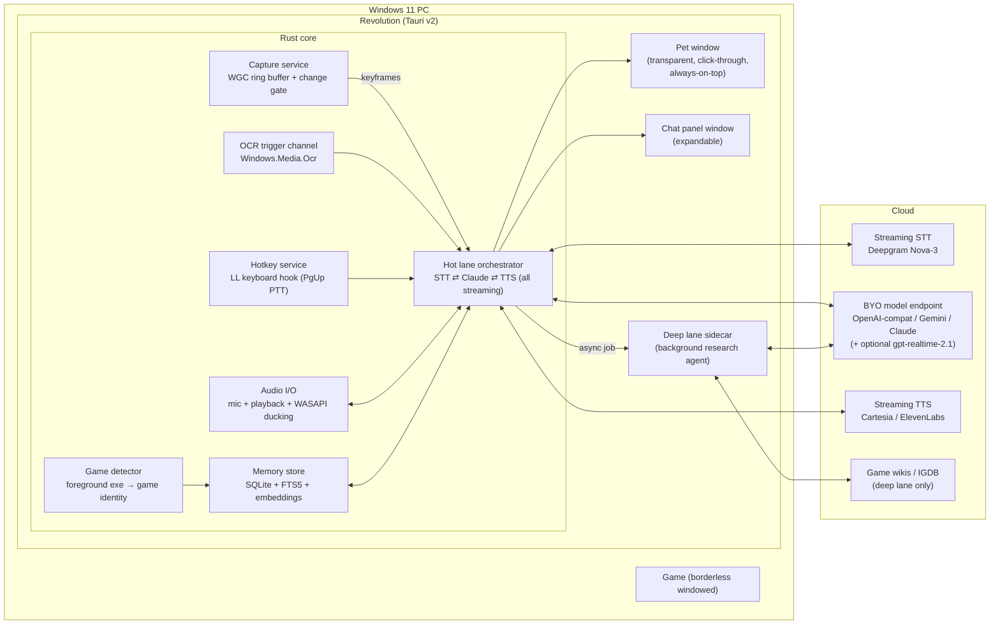

# Revolution — System Design

*A real-time AI gaming companion for Windows 11. Design v1, July 2026. Research-backed; sources and verification flags in [RESEARCH.md](RESEARCH.md).*

---

## 1. Vision & product principles

Revolution is a desktop pet that behaves like an expert friend sitting next to you while you game: it can see your monitor, you talk to it by holding a key, it answers out loud in a beat or two, and it remembers you — your character, your goals, what happened last session.

Five principles drive every decision below:

1. **Feel instant.** The pet must respond like a person, not a chatbot. Hard budget: **< 2s from push-to-talk release to first audible word**, with a visible "listening" reaction in < 100ms.
2. **Never cost frames.** The game owns the GPU. Revolution does no local ML inference on the GPU while a game runs, captures via GPU-copy only, and keeps idle CPU < 1% of one core.
3. **Watch and talk, never touch.** No DLL injection, no game-memory reads, no input automation — the entire anti-cheat-safe envelope that NVIDIA G-Assist and Microsoft Gaming Copilot also ship in.
4. **Frames leave the PC only when you ask.** Continuous capture stays in a RAM ring buffer. Upload happens on push-to-talk (or when the user explicitly enables ambient commentary). Visible capture indicator, always.
5. **A friend, not a feed.** Proactive chatter is opt-in and rate-limited. Memory makes it personal; spoiler-guard keeps it kind.

**Non-goals (v1):** playing the game for you (input automation), mobile/console, macOS/Linux, esports-grade per-frame coaching, local-only LLM mode.

---

## 2. System overview

One Tauri v2 application: a Rust core (capture, audio, hotkeys, memory, AI clients) with two WebView2 windows (pet sprite + chat panel), plus an optional Node sidecar for deep research jobs.



**Why one Rust core:** capture, audio, hotkey hooks, and change detection are all latency- and overhead-sensitive native work; Rust gives us one process, one memory budget, and direct access to the exact Win32/WinRT APIs we need. The UI is just pixels — WebView2 renders the pet and panel at negligible cost. The deep lane is the only place a second runtime (Node) is justified, and only in Phase 3.

---

## 3. UX specification

### 3.1 The pet

A small (~120–200px) sprite pinned above the game (user-draggable, position remembered per monitor). States:

| State | Trigger | Visual |
|---|---|---|
| `sleeping` | no game detected / capture off | zzz idle |
| `watching` | game in foreground, capture running | subtle idle animation + **persistent small "eye" capture indicator** |
| `listening` | PTT held | ears up + waveform ring (must appear < 100ms after key-down) |
| `thinking` | request in flight | thought-bubble shimmer |
| `speaking` | TTS playing | mouth/bounce animation, speech text in a bubble |
| `alert` | deep-lane result ready / proactive tip | gentle bounce + badge (never audio-interrupts unprompted) |

The pet window is click-through by default; hovering directly over the sprite makes it interactive (drag, right-click menu). Implementation: `set_ignore_cursor_events` toggled by a ~60Hz cursor-position poll in Rust — the proven Tauri overlay pattern (see RESEARCH §3) — plus `WS_EX_NOACTIVATE` so clicking the pet never steals game focus.

### 3.2 The talk loop (core interaction)

- **Hold Page Up** (rebindable; hold-to-talk default, toggle mode in settings): pet flips to `listening`, game audio ducks to ~40%, mic streams to STT, **and the current frame is captured + encoded immediately on key-down** so vision context is ready before the user finishes speaking.
- **Release**: STT is force-finalized (~100–300ms), the question + frames + memory context go to the configured model as one streaming request, and the reply streams sentence-by-sentence into TTS. First audio in ~0.8–1.8s; the text simultaneously types into the pet's speech bubble. *Example: playing Palworld, "what's the best Pal for this task?" → the model sees your base + party from the frames, knows your progression from memory, and can fire a native web search for current tier lists when its own knowledge isn't fresh enough (§6.1b).*
- **Barge-in**: pressing PTT while the pet is speaking instantly (< 60ms) stops playback, flushes the TTS queue, cancels the in-flight LLM stream, and starts listening. PTT makes interruption deterministic — no VAD needed, no echo problem (we never record while the pet speaks).
- **Chat panel**: PgUp double-tap (or pet click) opens a panel with the running transcript, typed input, screenshots referenced, and deep-lane tip cards. On multi-monitor setups the panel can dock to the second monitor.

### 3.3 Modes

- **Q&A (default):** the pet only speaks when spoken to.
- **Hype mode (opt-in):** low-rate ambient commentary — the cheap-model lane looks at a keyframe every ~1–2 minutes (and on big scene changes) and may drop a one-liner. Governed by the **cadence contract** (validated by the category leader's best-received design): unprompted remarks land only in natural pauses — between rounds, after deaths/respawns, in menus/loading/travel/farming lulls — and **never over an active fight**; "say nothing" is always a valid output. Reaction triggers worth remarking on: clutch/win just resolved, death worth a gentle roast, loot/level milestones, wasted-resource moments (ult spent in a won round), long farming silence. Genre presets tune what the model watches for (FPS: economy/positioning/rotations; RPG/survival: builds, base, quests) — auto-selected from the detected game, zero config. Hard rate-limit slider (max N remarks / 10 min) on top.
- **Spoiler guard (default on):** memory + system prompt instruct the model to never reveal plot or future content unless asked explicitly.

---

## 4. The latency budget (the contract everything serves)

Measured end-to-end target, PTT **release → first audible word**, all-cloud streaming path:

| Stage | Budget (p50) | Notes |
|---|---|---|
| 0. Capture + JPEG encode + (optional) pre-upload | **0ms on critical path** | done at key-*down*, in parallel with speech |
| 1. STT finalize on release | 100–300ms | audio pre-streamed during hold; `Finalize` on release |
| 2. Claude request upload + first token | 550–1,150ms | dominant leg; cached prompt prefix + downscaled frames |
| 3. First sentence → TTS first audio | 100–250ms | websocket TTS, sentence-chunked |
| 4. Output buffer / device | 30–60ms | WASAPI shared mode |
| **Total** | **~0.8–1.75s p50** | p95 risk ~2.3s — mitigations below |

Levers that keep p95 under control (all specified later in this doc): frozen cached prompt prefix (cache reads are ~10× cheaper *and* faster to ingest), frames downscaled to ~1024–1344px, `effort: low` + short-first-sentence prompting, screenshot pre-upload at key-down via the Files API, and cache pre-warming at session start. **Phase 0's whole job is to measure this table for real** (see ROADMAP).

Perceived latency also has a floor trick: the pet reacts *visually* at key-down (<100ms) and can play a subtle acknowledgment sound at release, so the wait reads as "friend thinking," not "app loading."

---

## 5. Screen understanding pipeline

### 5.1 Capture (continuous, near-free)

- **API:** Windows.Graphics.Capture (WGC) via the [`windows-capture`](https://github.com/NiiightmareXD/windows-capture) crate (v2.x). WGC is the modern, OBS-endorsed path; DXGI Desktop Duplication is legacy and now unreliable under Win11 24H2 MPO. WGC is event-driven — frames arrive only when content changes.
- **Target:** capture the **game window (HWND)**, not the monitor. This keeps the pet out of its own screenshots without `WDA_EXCLUDEFROMCAPTURE` (which is a known cheat-tool signature — see §11). Monitor capture remains a fallback for non-game "help me with my desktop" usage.
- **Win11 24H2 niceties:** `MinUpdateInterval` (OS-level throttle to our ~1fps), `DirtyRegionMode`, and `IsBorderRequired = false` (after `GraphicsCaptureAccess.RequestAccessAsync`) to remove the yellow capture border.
- **Cost:** effectively zero at our cadence (GPU copy; the same mechanism OBS uses at 60fps for single-digit GPU %). JPEG encode of a 720p frame ≈ 3–8ms of one core via libjpeg-turbo, at ~1fps → noise.

### 5.2 Change gate + keyframe ring buffer

```
WGC frame → GPU downscale → 320×180 thumbnail → dHash (64-bit) → Hamming distance vs last keyframe
    ├─ distance ≥ threshold (tune ~10–16 bits)  → promote to keyframe
    ├─ heartbeat: force keyframe every 15–30s even if static
    └─ else drop
Keyframe → full/half-res JPEG (quality ~80, long edge ≤1344px) + timestamp + OCR text → RAM ring buffer (last ~3 min, ~30–60 frames, ~15–30 MB)
```

- dHash + histogram-fallback gating costs ≪0.1% of a core at 1–4Hz on thumbnails; the tuning effort goes into **thresholds per genre** (HUD-heavy games produce constant small deltas; cutscenes constant large ones) — combine hash distance + minimum inter-keyframe interval + heartbeat.
- The ring buffer lives in RAM only and is wiped on exit. Nothing is written to disk, nothing leaves the machine until a question is asked.

### 5.3 Frame selection at question time

On PTT release, attach **1–3 frames**: always the freshest frame (captured at key-down), plus up to 2 recent keyframes chosen by change-score and temporal spacing (covers "what just happened?" questions). Each frame at ~1024–1344px long edge ≈ 1,100–1,600 tokens (Claude image cost ≈ (w×h)/750). A "read the fine print" escalation path re-sends the freshest frame at up to 1568–2576px when the model asks for it via a tool call.

### 5.4 OCR trigger channel (cheap high-frequency signal)

`Windows.Media.Ocr` (built into every Win11, offline, fast) runs over thumbnails/regions at ~0.2–1Hz:

- Feeds the **change gate** with semantic triggers (kill feed lines, quest text updates, loading screens, big HUD number deltas) — better keyframe promotion than pixels alone.
- Extracted text is attached alongside frames at question time (grounds the vision model, catches tiny HUD text that survives downscaling poorly).
- Caveat: officially gated behind package identity — we ship with MSIX/sparse identity to use it cleanly. OneOCR (Snipping Tool engine) is a higher-accuracy option but is a legal gray zone (extracted from a Store app) — noted, not shipped.

### 5.5 Game detection & context enrichment

Layered ladder, each step cheap:

1. Foreground window → PID → exe path (`SetWinEventHook(EVENT_SYSTEM_FOREGROUND)`).
2. Exe → game identity via Discord's public detectable-games DB (cached locally; schema-drift tolerant).
3. Steam `appmanifest_*.acf` enumeration → appid (the `RunningAppID` registry key is dead; do not use).
4. Window title fuzzy match as last resort.

Game identity keys the memory store (per-game profile), selects the persona flavor ("we're playing Elden Ring — souls-veteran mode"), and unlocks **per-game adapters** (Phase 3+): LoL Live Client Data API (`localhost:2999`), CS2/Dota 2 Game State Integration, etc. — structured local game state beats vision when available.

---

## 6. The brain: BYO provider layer, routing, prompts

### 6.0 Bring-your-own-model (a hard requirement)

The user plugs in **their own endpoint, API key, and model choice** — Gemini Flash, a ChatGPT-class model, Claude, or any OpenAI-compatible endpoint (OpenRouter, Groq, a local server). The core therefore speaks to models through one `ChatProvider` abstraction with three adapters:

| Adapter | Wire protocol | Vision input | Native web-search tool | Notes |
|---|---|---|---|---|
| **OpenAI-compatible** | `POST {base_url}/chat/completions`, SSE streaming; Responses API variant for native search | data-URI base64 images | `web_search` (Responses API); xAI Live Search via `search_parameters` | `base_url` override covers **xAI Grok** (`https://api.x.ai/v1`), OpenRouter, Groq, local servers — the widest BYO surface |
| **Google Gemini** | `streamGenerateContent`, SSE | `inline_data` base64 | `google_search` grounding tool | Flash-class models are the budget/latency sweet spot for the hot lane |
| **Anthropic Claude** | `POST /v1/messages`, SSE | base64 image blocks | `web_search_20260209` / `web_fetch_20260209` | Adds explicit prompt caching + high-res vision tier (2576px) |

Every adapter normalizes to the same internal stream events (`TextDelta`, `ToolActivity`, `Usage`, `Done`) so the orchestrator, TTS chunker, and cost meter don't care which brain is plugged in.

### 6.1 Role routing (user-configurable; sensible defaults per provider)

Models are chosen **per role** in `config.toml`, not hardcoded. Subscription note: consumer-app credits (e.g. a SuperGrok plan's in-app allowance) are usable only if the vendor grants matching **API** credits (for xAI: check console.x.ai) — Revolution talks to APIs, not consumer apps.

| Role | Latency budget | What to configure | Example choices |
|---|---|---|---|
| `qa` (PTT hot lane) | TTFT < ~800ms | fast vision model, short-answer prompting | Gemini Flash-class · GPT fast tier · Grok fast tier (via xAI base_url — Razer's Ava companion ships on Grok) · `claude-opus-5` at `effort: low` (or `claude-haiku-4-5` for max speed) |
| `ambient` (hype mode) | relaxed, cost-bound | cheapest vision model | Gemini Flash-Lite-class · GPT mini tier · `claude-haiku-4-5` |
| `deep` (research jobs) | minutes | strongest model + native web search | GPT flagship · Gemini Pro-class · `claude-opus-5` (optional `claude-fable-5` "galaxy-brain" toggle at 2× price) |
| `realtime` (optional, §7.4) | speech-to-speech | realtime voice model | `gpt-realtime-2.1` |

Latency tuning notes (Phase 1 measures on the user's own keys, then decides):

- Claude specifics: Opus 5 has thinking on by default; adaptive + `effort: low` is the fast configuration. `thinking: disabled` (allowed at effort ≤ high) has two known failure traps (tool calls emitted as plain text; `<thinking>` tag leakage) with documented prompt mitigations — prefer adaptive+low or a faster model tier first. Handle `stop_reason: "refusal"` before reading content; optionally enable server-side `fallbacks: "default"`.
- Prompt for voice shape regardless of provider: short first sentence ("Alright, so—"), answer-first, ~2–4 spoken sentences; details go to the panel text.
- The debug overlay records TTFT per provider/model so users can compare *their* candidates empirically.

### 6.1b Web browsing in the live loop (updated-information requirement)

"What's the best Pal for task X?" (Palworld) needs *current* wiki knowledge, the live screen, and memory together. All three adapters expose their provider's **native server-side web search** to the `qa` role, with a two-beat latency strategy:

1. **Beat 1 (instant):** the model answers from screen + memory immediately — prompted to give its best grounded take and *say* when it's checking ("From what I can see you're mid-farm — let me double-check the wiki real quick…"). Search-free turns keep the normal < 2s budget.
2. **Beat 2 (seconds later):** when the model invokes search, tool activity streams to the pet as a "looking it up 🔍" state, and the refined answer continues in the same voice stream. Search-augmented turns are allowed to take 3–8s — the acknowledgment keeps it feeling like a friend thinking, not an app hanging.
3. Questions the model judges bigger than an inline search ("theorycraft my whole build") get handed to the **deep lane** (§9) with a spoken heads-up.

### 6.2 Prompt architecture (built for the cache)

One prompt layout serves all providers: stable content first, volatile content last. OpenAI and Gemini apply **automatic prefix caching** server-side, and Anthropic's explicit `cache_control` rewards the exact same shape — so the layout below is provider-neutral, with the breakpoint mechanics applying when the configured provider is Claude. Layout, coldest to hottest:

```
[ CACHED, 1h TTL ]  tools (fixed order) + frozen system prompt (persona, voice style,
                    spoiler-guard rules, output-shape rules)          ← breakpoint 1
[ CACHED, 1h TTL ]  per-game profile card (~300–800 tok) + rolling session summary
                    — changes ONLY at compaction/session boundaries   ← breakpoint 2
[ append-only ]     recent turns; images live only in the newest 2–3 user turns
                    dynamic state ("game switched", memory retrievals) injected as
                    {"role":"system"} messages appended to messages[] (supported on
                    Opus 5 — preserves the cached prefix; Haiku lane uses a
                    <system-reminder> text block instead)
[ hottest ]         current question + 1–3 frames                     ← breakpoint 3 (moves each turn)
```

Rules that make this actually cache:

- **Frozen system prompt**: no timestamps, session IDs, or conditional sections. All volatile state arrives late in `messages`.
- **Byte-stable frames**: never re-encode or mutate an image already in history — append-only. A re-encoded byte-different JPEG silently invalidates the whole message-tier cache.
- **20-block lookback**: image+tool-heavy turns can exceed the cache's 20-content-block lookback — place an intermediate breakpoint every ~15 blocks.
- **Pre-warm**: at game-session start, fire a `max_tokens: 0` request to write the 1h-TTL prefix cache so the *first* question already gets cache-read pricing/latency. (Opus 5 min cacheable prefix is 512 tokens — our prefix is far above. Haiku's minimum is 4096; the ambient lane's lean prompt may simply not cache, which is fine at its price.)
- Verify with `usage.cache_read_input_tokens` in the debug overlay; zero on repeat turns = a silent invalidator regressed.

### 6.3 Context compaction (images are the bloat)

20 questions × 2 frames ≈ 50K+ tokens of dead screenshots. Policy: when the transcript exceeds **~30–50K tokens or ~10 stored images**, run client-side compaction — LLM-summarize old turns into a compact narrative, replace old image blocks with one-line placeholders (`[screenshot: inventory, 14:32]`), keep the last 2–4 turns verbatim, **write the summary into the memory store**, and rebuild. This costs one deliberate cache rebuild per compaction and is far cheaper than dragging frames forever. (Server-side context editing / compaction betas exist as alternatives; client-side keeps the summary in our memory store, which we want anyway.)

### 6.4 API integration

The adapters are implemented **sans-IO in the Rust core**: each one is a pure request-builder (exact JSON body + headers for its wire protocol) plus an SSE-event parser that emits the normalized stream events. This makes every provider's request shape and stream handling unit-testable without network access (see `core/src/providers/` and VALIDATION.md), and lets the desktop shell own the actual HTTP transport (`reqwest`). Rust has no official SDKs for these providers, so raw HTTPS/SSE is the sanctioned pattern. Provider-specific optimizations: Anthropic gets `cache_control` breakpoints and (Phase 2) key-down JPEG pre-upload via the Files API (`files-api-2025-04-14`) referenced by `file_id`; Gemini and OpenAI send inline base64 (their caching is automatic). The deep-lane sidecar (Node, Phase 3) uses official SDKs.

---

## 7. Voice pipeline

### 7.1 Speech-to-text

| Choice | Role | Numbers |
|---|---|---|
| **Deepgram Nova-3 streaming** | primary | one websocket per session, `KeepAlive` between presses; stream during hold; `Finalize` on release → final text in ~100–300ms; ~$0.0077/min billed on streamed audio only (~3 min of actual talk per hour ≈ $0.02/hr) |
| AssemblyAI Universal-Streaming | equal alternative | `ForceEndpoint` maps 1:1 to PTT release; $0.15/session-hr billing model |
| Groq Whisper large-v3-turbo (batch POST) | v0 shortcut | no websocket state; POST the clip on release; ~200–350ms total; $0.04/audio-hr — costs ~150–250ms vs streaming but trivially simple |
| **Moonshine v2 small / whisper.cpp base.en (CPU)** | offline fallback | Moonshine's streaming encoder finalizes in ~150–300ms on CPU; runs at below-normal thread priority; never touches the GPU |

### 7.2 Text-to-speech

| Choice | Role | Numbers |
|---|---|---|
| **Cartesia Sonic-3 / Turbo (websocket)** | primary | ~40–90ms model-side TTFA; *continuations* API is purpose-built for LLM token streaming (prosody survives chunking); cheapest at scale |
| ElevenLabs Flash v2.5 (websocket) | persona-variety alternative | ~75ms TTFA; best voice library for giving the pet a personality; ~2–6× Cartesia's price |
| **Kokoro-82M (local CPU)** | offline fallback | Apache-licensed, excellent for 82M params; RTF ~0.2–0.5 on CPU → first short sentence in ~0.4–1.5s under game load |

Pipeline: stream Claude tokens → cut at first sentence boundary (or ~50 chars + punctuation) → feed TTS websocket immediately → play sentence 1 while sentence 3 is still being written. This overlap is the difference between "instant friend" and "loading bar."

### 7.3 Audio behavior

- **Ducking:** enumerate render sessions (`IAudioSessionManager2`), identify the game's session by PID, `ISimpleAudioVolume::SetMasterVolume(~0.4)` during `listening` and `speaking`, restore after. (Same mechanism Discord uses; WASAPI-exclusive-mode games bypass it — rare, documented limitation.)
- **Barge-in:** key-down during playback → stop output stream, flush queue, cancel TTS context and LLM stream. Target < 60ms.
- **Echo:** structurally solved by PTT — we never capture while the pet is speaking (key-down stops playback first). Game noise in speakers-only setups is handled by ducking during the hold + Nova-3's noise robustness.

### 7.4 Pipeline B (add-on): speech-to-speech realtime

For users who want a fully conversational voice loop, the `realtime` role connects to **OpenAI `gpt-realtime-2.1`** (WebRTC/WebSocket session): audio in → audio out with sub-1s voice-to-voice, native interruption handling, **image input attached into the live session** (our key-down keyframes), and tool use (web search) inside the session. Trade-offs vs. Pipeline A, stated honestly in settings:

| | Pipeline A (STT → LLM → TTS) | Pipeline B (gpt-realtime-2.1) |
|---|---|---|
| Voice-to-voice | ~0.8–1.8s | ~sub-1s |
| Brain choice | **any** provider/model per role | locked to OpenAI realtime models |
| Voice persona | any TTS vendor/voice | OpenAI voices |
| Cost | itemized STT+LLM+TTS (§13) | per-audio-minute realtime pricing (≈$0.06/min in, ≈$0.24/min out; mini tier ≈1/3) |
| Memory/prompt control | full (our prompt architecture) | session-instruction level |

Both pipelines share everything else — capture, keyframes, memory injection, pet UI, ducking, PTT. Pipeline B is an adapter behind the same orchestrator, not a fork of the app.

---

## 8. Memory system

One SQLite database (bundled; also used for app state). Local-only, per-game keyed.

```sql
games(game_id, name, exe, steam_appid, wiki_base_url, ...)
profiles(game_id, markdown, updated_at)                     -- the per-game "profile card"
episodes(id, game_id, started_at, ended_at, summary_md, embedding)
facts(id, game_id, text, kind, embedding, created_at, updated_at, status)
-- + FTS5 virtual tables over profiles/episodes/facts
```

- **Profile card** (~300–800 tokens, model-maintained): character/class/build, current goals, preferences ("don't spoil", "call me Chief"), key NPCs/quests. Injected on every turn from the cached prefix (§6.2) — it *is* the "remembers me" feeling. Letta-style core-memory block, persisted.
- **Write path:** the hot lane exposes two tools — `remember(text, kind)` and `update_profile(patch)` — so the model jots things down mid-conversation. At session end (game closes), a background job summarizes the transcript into an `episode` and runs a **Mem0-style ADD / UPDATE / DELETE / NOOP gate** over extracted facts against their top-k nearest existing facts — this is what prevents "player is level 12 / level 30 / level 45" clutter.
- **Read path:** every turn gets profile + last episode summary (cache-friendly — changes only at boundaries). Questions that aren't purely "what's on screen" additionally get top-3–5 **hybrid retrieval** hits (FTS5 BM25 ∪ cosine, merged, filtered by `game_id`) injected as a late `role:"system"` message. Hybrid matters: game jargon (item/boss names) is exact-match-y.
- **Embeddings:** `bge-small-en-v1.5` int8 via the `fastembed` Rust crate (ONNX, CPU, 384-d, ~34MB, low-single-digit ms per memory). Brute-force cosine is ~1–10ms up to tens of thousands of rows — no vector DB needed; `sqlite-vec` is the escape hatch if we're wrong.
- **Footprint:** < 50MB model + a few MB of DB after months. All deletable from the settings UI ("forget this game" / "forget everything").

---

## 9. Deep lane: the researcher friend

Some questions deserve minutes, not seconds: *"What's actually the best build for my level-34 samurai?"* The hot lane answers immediately from screen + memory, **and** (when the model judges it useful or the user asks) enqueues a deep job. The pet's `alert` state + a tip card in the panel deliver the result a few minutes later — the live conversation never blocks.

**Phase 3a — no framework:** a background streaming request to the user's configured `deep` model with its **native web search/fetch tools** (all three adapters support this, §6.0) and domain hints (game's wiki base URL from the `games` table, IGDB metadata). Zero new infrastructure; covers most "look it up for me" jobs. The hot lane's inline search (§6.1b) handles quick lookups; the deep lane exists for multi-page, multi-step jobs.

**Phase 3b — a real harness, if jobs outgrow single-request search.** Evaluated head-to-head (full comparison in RESEARCH §1):

| Option | Verdict |
|---|---|
| **Claude Agent SDK** (TS sidecar) | **Default choice.** Managed agentic loop, built-in web tools, MCP, subagents, session persistence; tightest fit since the brain is already Claude. |
| **Hermes Agent** (Nous Research) — the harness you remembered | **Legitimate alternative for exactly this lane.** MIT, model-agnostic, Windows-native, ships memory/skills/MCP, embeddable as a sidecar via `hermes acp` (stdio JSON-RPC) or its WebSocket/HTTP gateway. Caveats: 0.x velocity (breaking changes, 25K+ open issues), app-shaped rather than library-shaped, ~0.9s cold dispatch. |
| Hermes on the **hot path** | **Ruled out** — its dispatch overhead + heavy skills/memory prompt cannot fit a sub-2s voice budget (true of *any* full harness, Agent SDK included). Nous's own docs steer the harness toward frontier cloud models for agentic loops, which matches our design. |

The deep lane reads the same SQLite memory store (profile + episodes) so research is personalized ("he's a dex build, don't recommend strength weapons"), and its findings are written back as `facts`.

Structured knowledge sources for adapters and the researcher: IGDB (free via Twitch OAuth; 4 req/s), Steam appdetails, PCGamingWiki Cargo API, and the MediaWiki APIs behind Fandom / wiki.gg / independent wikis (`opensearch` → `parse` — no auth).

---

## 10. Performance engineering

Budgets (enforced by a debug overlay + CI perf smoke test):

| Resource | Idle (watching) | During PTT turn | Never |
|---|---|---|---|
| CPU | < 1% of one core | < 15% of one core, < 2s burst | sustained multi-core use |
| GPU | capture copy only (~0) | + one downscale/encode | local ML inference while a game runs |
| RAM | < 150MB total incl. WebView2 (+ ring buffer ~15–30MB) | same | unbounded transcript growth (compaction, §6.3) |
| Disk | ~0 writes | ~0 | frame persistence |
| Network | ~0 (KeepAlive pings) | one request + audio streams | continuous frame upload (Q&A mode) |

Practices: STT/OCR/embedding threads at below-normal priority; all cloud work on async I/O (no thread-per-request); local fallback models are CPU-only by design (the GPU belongs to the game); measure real FPS impact with PresentMon on a 3-game matrix (competitive shooter / open-world AAA / indie) every release. Numbers marked as estimates in RESEARCH.md get measured in Phase 1 before we commit to them.

**Performance profiles.** The table above is the *Balanced* default so the app is safe on any PC. On a high-end rig (the reference machine is an RTX 4070 Ti + i5-13600 + 32GB DDR5), the **Headroom** profile scales up without touching the game's GPU: bigger ring buffer (~5 min / 60+ keyframes), frames kept at 1568px, higher-quality CPU fallback models (whisper small-class STT, Kokoro TTS at full quality), embeddings always-on, and more aggressive OCR cadence — the 13600's spare threads absorb all of it. A future experiment flag may allow a small local VLM for the *ambient* lane on 12GB+ cards, but cloud models remain the recommended brain: the quality gap matters more than the pennies, and the GPU stays 100% the game's.

---

## 11. Anti-cheat & compatibility policy

**Envelope: passive out-of-process capture + a plain always-on-top window + zero game-process interaction.** This is the pattern BattlEye explicitly tolerates, that OBS display-capture uses, and that Microsoft Gaming Copilot / NVIDIA G-Assist ship at scale. Specifically:

- **Never:** DLL injection, reading/writing game memory, input synthesis/automation, in-process overlay hooks. (These are also why we don't act in-game — watch and talk only.)
- **Capture the game HWND, not the monitor**, so the pet isn't in frame — avoiding `WDA_EXCLUDEFROMCAPTURE`, which is a documented "streamproof cheat" signature that at least one anti-cheat actively enumerates. If a user enables monitor capture, WDA exclusion is opt-in with this risk documented.
- **Borderless windowed required** (first-run tip). True exclusive fullscreen both defeats overlays and isn't guaranteed capturable — and it's effectively obsolete on Win11.
- **Riot Vanguard:** blocks *injected* overlays at launch; a separate always-on-top window doesn't inject anything into the game and per Riot's own dev FAQ, non-memory-reading external tools "should continue to function." **FACEIT** is the most aggressive client — flagged for explicit testing; worst case the pet auto-hides for FACEIT matches and stays voice-only.
- Publish the policy in-app ("what Revolution never does") — trust is a feature.

---

## 12. Privacy & trust

The Xbox Gaming Copilot backlash (Oct 2025 — auto-screenshotting with a default-on training toggle) is the cautionary tale. Our defaults:

- Frames live in a **RAM ring buffer only**, wiped on exit; nothing persists to disk; nothing uploads until you ask (or explicitly enable hype mode — which uploads only gated keyframes and says so).
- **Always-visible capture indicator** on the pet while watching; one click pauses capture entirely.
- Capture auto-stops when the game loses foreground (configurable) — the pet doesn't watch your desktop, email, or browser by default; non-game watching is a separate explicit toggle.
- Memory is local SQLite, per-game viewable/editable/deletable in settings. No cloud account, no telemetry by default; the only third parties are the AI providers the user configures, and screenshots/audio go to them solely to answer the user's own requests.
- API keys (Anthropic, Deepgram, Cartesia/ElevenLabs) stored in Windows Credential Manager, user-supplied (bring-your-own-key in v1).

---

## 13. Cost model (estimates — Phase 1 verifies on the user's keys)

Cost depends entirely on which provider/models the user configures; the worked example below uses the Claude routing so the math is concrete (a Gemini-Flash-class or GPT-mini-class `qa` model lands well below it — roughly the "turbo" row). The app's live cost meter uses each response's `usage` field, so real numbers replace estimates immediately.

Assumptions: 20 PTT questions/hour, 2 frames/question at ~1.2K tokens each, ~5K uncached input + ~4K cached-read prefix per question, ~150 output tokens (spoken answers are short), Opus 5 pricing $5/$25 per MTok, cache reads ~0.1×.

| Component | Est. $/active-hour |
|---|---|
| Q&A LLM (Opus 5, cached) | ~$0.60 |
| STT (Deepgram, ~3 min actual talk) | ~$0.02 |
| TTS (Cartesia, ~4K chars) | ~$0.05–0.20 |
| **Default total** | **~$0.7–0.9/hr** |
| Hype mode add-on (Haiku 4.5, ~30 keyframe calls/hr) | +~$0.10 |
| "Turbo" mode (Haiku for Q&A too) | total ~**$0.10–0.15/hr** |
| Deep research job (Opus 5 + web tools) | ~$0.05–0.30 per job (+ per-search tool fees; measure) |
| Galaxy-brain deep job (Fable 5, opt-in) | ~2× Opus deep job |

A monthly budget cap with a live meter is a first-class settings feature: the app tracks `usage` from every response and degrades gracefully (turbo mode → text-only → paused) as the cap approaches.

---

## 14. Tech stack & repo layout

| Concern | Choice |
|---|---|
| App shell / UI | **Tauri v2** — Rust core + WebView2; transparent frameless always-on-top pet + panel windows (proven overlay pattern: ~14MB main-process RAM, <1% idle CPU; 30–50MB total vs Electron's 150–300MB) |
| Capture | `windows-capture` crate (WGC), 24H2 session features via `windows` crate as needed |
| Hotkeys | `WH_KEYBOARD_LL` low-level hook (e.g. `rdev`) on a dedicated thread — key-down/up for hold-PTT, works over fullscreen games; Tauri global-shortcut plugin as first attempt |
| Audio | WASAPI via `cpal`/`windows` crate; `IAudioSessionManager2` ducking |
| OCR | `Windows.Media.Ocr` (WinRT), MSIX/sparse package identity |
| Change detection | dHash + histogram fallback (in-crate, ~100 LoC) |
| Memory | `rusqlite` + FTS5; `fastembed` (bge-small-en-v1.5 int8); optional `sqlite-vec` |
| Model providers (hot) | sans-IO adapters in `revolution-core` (OpenAI-compatible / Gemini / Anthropic request builders + SSE parsers, unit-tested); transport via `reqwest` in the shell; realtime add-on per §7.4 |
| STT/TTS | Deepgram ws / Cartesia ws (Rust `tokio-tungstenite`); local fallbacks Moonshine v2 / Kokoro (ONNX, CPU) |
| Deep lane | Node sidecar: Claude Agent SDK (default) or Hermes Agent via `hermes acp` (alternative) |
| UI runtime | Svelte or React in WebView2; sprite via canvas/CSS (VPet's animation state machines as reference) |

Planned layout:

```
revolution/
├─ src-tauri/            # Rust core
│  ├─ capture/           # WGC, change gate, ring buffer
│  ├─ ocr/
│  ├─ hotkey/
│  ├─ audio/             # mic, playback, ducking
│  ├─ brain/             # claude client, prompt builder, caching, routing
│  ├─ voice/             # STT/TTS clients + local fallbacks
│  ├─ memory/            # sqlite, embeddings, compaction, session summarizer
│  └─ gamedb/            # detection ladder, adapters
├─ ui/                   # pet + panel (WebView2)
├─ sidecar-deep/         # Phase 3: Agent SDK / Hermes integration
└─ docs/
```

---

## 15. Risks & open questions

| Risk | Mitigation |
|---|---|
| Vision-LLM TTFT blows the p95 budget (softest number in our research) | Phase 0 measures Opus 5 + Haiku TTFT with images + cached prefix; routing/effort/thinking knobs in §6.1; worst case: Haiku answers first ("quick take…") while Opus refines |
| Tauri click-through/focus edge cases | Proven patterns exist (Manasight/Overlayed); WPF is the documented fallback shell (VPet precedent) |
| Global hotkey swallowed or dead in specific games (DirectInput titles) | LL-hook fallback + rebindable key + mouse-button PTT option |
| FACEIT / esports clients flag the overlay window | Explicit test matrix; auto-hide + voice-only mode for those clients |
| Haiku ambient lane can't prompt-cache (4096-token minimum prefix) | Accept uncached (cheap) or fatten prefix with game knowledge only if the math favors it |
| Windows OCR accuracy on stylized game fonts | It's a trigger channel, not ground truth — the vision model reads the actual frame; OneOCR upgrade path documented |
| STT/TTS vendor claims (75ms/40ms TTFA) are model-side, excluding network | Phase 0 measures from our client; both vendors have a swap-compatible alternative |
| Hermes Agent 0.x churn if chosen for deep lane | It's behind our own job interface; Agent SDK is the default; either is replaceable |
| Provider API drift (search-tool shapes, SSE formats differ per vendor) | Sans-IO adapters with golden request/stream tests catch drift in CI; one adapter per provider isolates blast radius |
| Cost drift with chatty users | Budget cap + live meter + turbo mode (§13) |

Open questions parked for later phases: persona/voice packs and pet art direction; packaged (MSIX) vs. sparse-identity distribution; opt-in cloud sync of memory; Twitch-streamer mode (pet visible on stream or not — window capture already keeps us out of *game* capture).
